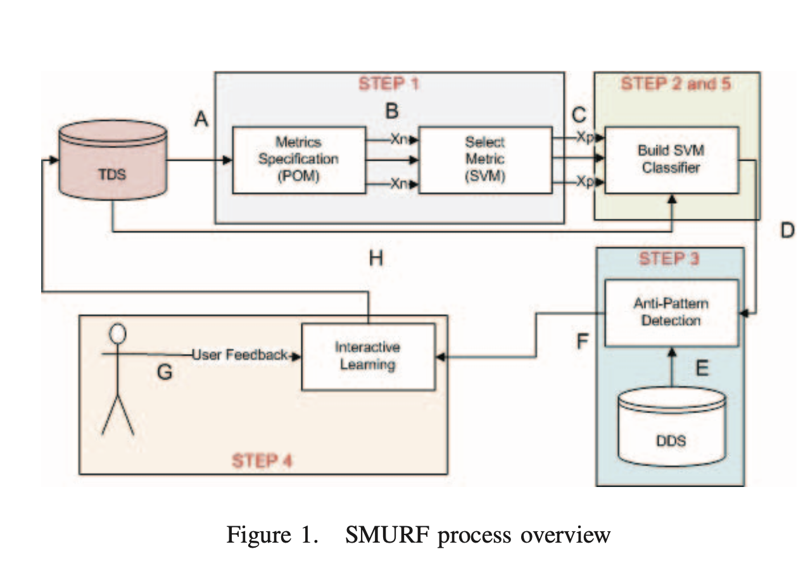
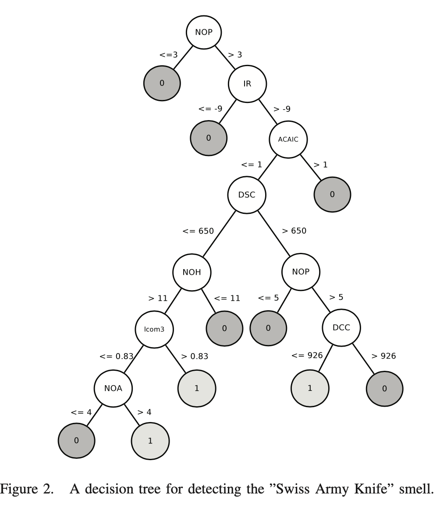

# ML Based Approaches Notes
This document summarizes machine learning approaches for code smell detection.

## Machine learning techniques for code smell detection: 
## A systematic literature review and meta-analysis
本文提出，虽然一般的Code Smell Detector有良好的检测精确度，但由于以下三点原因，基于机器学习的Code Smell检测方法有更大的优势：

1. 对于同一个Code Smell，不同的开发者有完全不同的理解方式，例如：对于`God Class`，一些程序员不认为这种Code Smell会引起严重的问题，是一个设计缺陷，但对于另一些程序员而言，这个Code Smell不会造成问题，无需修改。这导致Detector检测出的Code Smell对于不同的程序员有不同的接受度，这间接导致了Detector的用户数量下降。

2. 对于同一个Code Smell，不同的Code Smell Detector会得出不同的结果，例如：对于`God Class`，Detector `A`会检测出该问题的严重性为一般，Detector `B`得出该问题会导致BUG，十分严重。市场上众多的Detector得出的Code Smell分析参差不齐。

3. 对于那些依赖于固定的`Threshold`来分辨Code Smell的Detector而言，寻找一个合适的`Threshold`是十分困难的。而`Threshold`对于Detector检测的准确性以及用户的接受程度是十分关键的。这是依赖于固定的单一的`Threshold`来分辨Code Smell的Detector无法精确检测Code Smell的根本原因。

机器学习的检测方法就可以很好的解决上述问题。可以通过大量已经被标注出的、广泛接受的Code Smell，来训练出一个Code Smell检测模型，其得出的检测结果也应当是被广泛接受的，准确的。

历史上对于基于机器学习的探测方法的关注度还是很不够，本文对`2000`年到`2017`年的所有相关论文做了`Systematic Literature Review (SLR)`，来总结机器学习算法如何解决上述三个问题。对相关论文的总结包括如下四个方面：

1. 考虑的Code Smell的种类；

2. 机器学习算法所基于的数据与设定；

3. 机器学习的策略、模型、算法等；

4. Code Smell 检测算法的性能

总结的结论如下：
1. 被频繁认为会影响软件性能的Code Smell有：`God Class, Long Method, Functional Decomposition,`以及` Spaghetti Code`。
但是学界所提出机器学习方法中，能检测的Code Smell种类并不多，但有很多没有被检测出的Code Smell也会对应用程序的性能造成严重影响。

2. 学界主要使用的用于探测Code Smell的`metrics(指标)`是CK metric suite，其中包含`6`个指标：`WMC, DIT, NOC, CBO, RFC, `以及` LCOM1`。这些指标表征了一段代码的一致性、耦合程度以及复杂度。
但是使用**过程、文本**的检测指标没有被广泛的应用，这些也是检测Code Smell的优良指标。同时，**和开发者有关**的metrics完全没有人使用。这类指标可以有效降低检测结果的主观性。

3. 对于Code Smell的分类，`20%`的文献关注了二元的分类标准，`40%`的文献关注了基于可能性的分类标准，`40%`的文献关注了基于严重性的分类标准。
本文认为，基于严重性的分类标准应当受到更多关注，因为该标准明确地指出一个Code Smell对于代码性能影响的严重程度。

4. 对于Code Smell探测器所使用的机器学习算法，**决策树**(``Decision Trees``)以及**支持向量机**(``Support Vector Machines``)算法得到广泛的应用。这些算法将上一段中提出的**Metrics作为输入**，以事先标定好是否为Code Smell的大量项目代码作为**训练数据集**(`` training dataset``)，训练机器学习模型。
但是学界对于设定机器学习参数的问题，还没有良好的解决方案。同时，多种机器学习模型相结合（`ensemble techniques`）的解决方案还没有被提出。

    

    

5. 对于机器学习算法的运行环境，学界使用的训练数据集选取有偏见（`biased`），不能反应真实环境下的数据。

6. 基于多种互不相关的(`independent`)metrics训练出的机器学习模型具有更高的Code Smell检测性能。我们选取的数据应当多种多样。

基于本文总结的基于机器学习的Code Smell Detection算法，我们应当作出如下工作：

1. 搭建机器学习算法的运行环境，使其能高效的探测Code Smell，使用决策树算法；

2. 选取大量的多种来源的数据集；

3. 优化机器学习算法，并扩展其功能，如添加更多种类的Code Smell。要多添加对应用程序性能影响较大的Code Smell；

4. 也可以将Code Smell的探测分为多个阶段，如Code Smell、Metric的分类阶段，从而使用多种机器学习算法，得到更加精准的探测结果。

## References
* A. Maiga, N. Ali, N. Bhattacharya, A. Sabané, Y. Guéhéneuc and E. Aimeur, "SMURF: A SVM-based Incremental Anti-pattern Detection Approach," 2012 19th Working Conference on Reverse Engineering, Kingston, ON, 2012, pp. 466-475, doi: 10.1109/WCRE.2012.56.
* S.R. Safavian, D. Landgrebe, A survey of decision tree classifier methodology, IEEE Trans Syst Man Cybern 21 (3) (1991) 660–674.